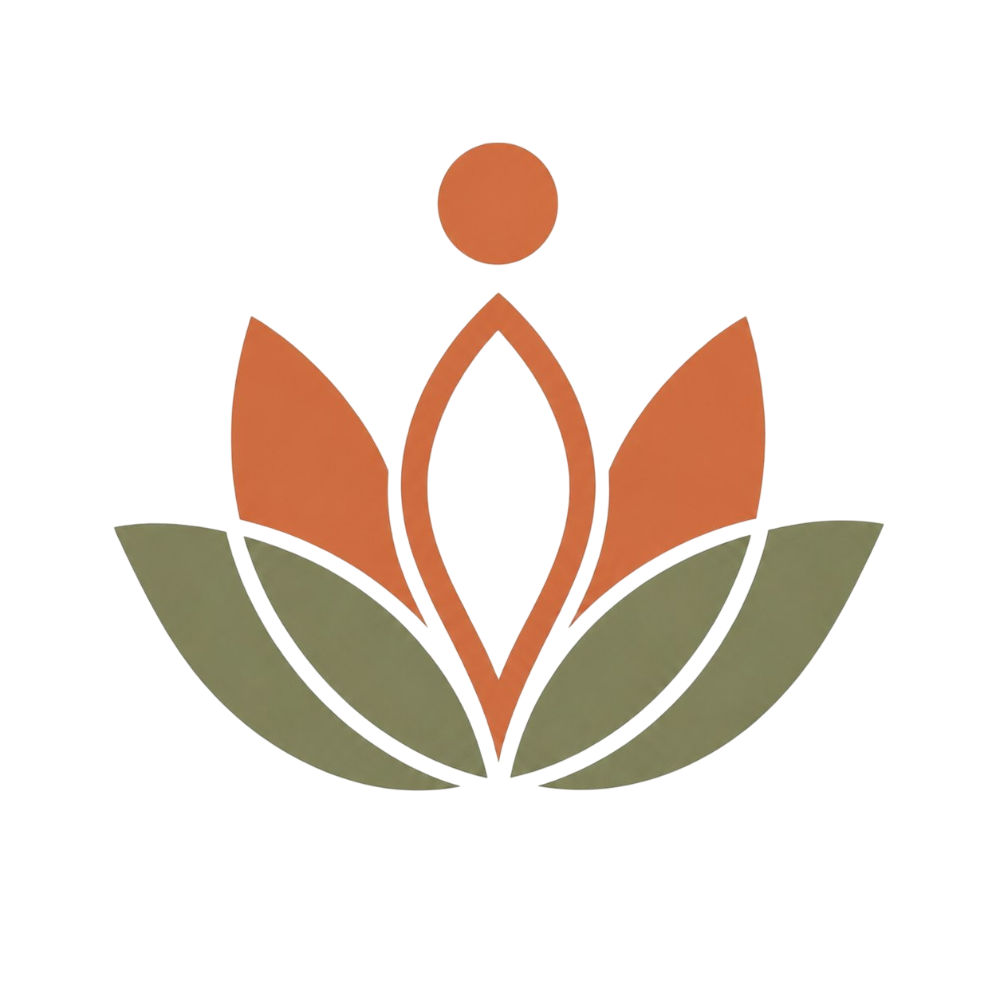
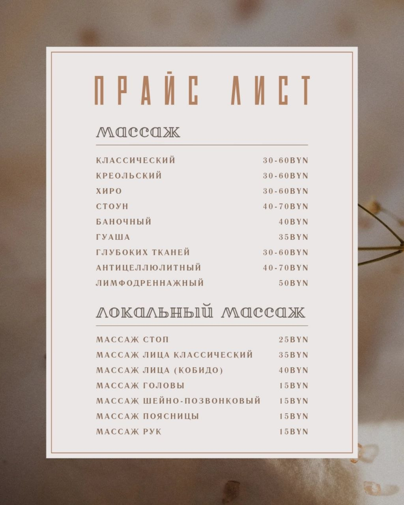

<!DOCTYPE html>
<html lang="ru">
<head>
    <meta charset="UTF-8">
    <meta name="viewport" content="width=device-width, initial-scale=1.0">
    <title>Студия массажа Молодечно | Забота о теле</title>
    
</head>
<body>

    <!-- Шапка -->
    <header>
        
        <h1>Студия массажа</h1>
        
Молодечно · Забота о вашем теле

    </header>

    

        <!-- О нас -->
        <section>
            <h2>О нас</h2>
            

                Мы — студия массажа в Молодечно, где каждый гость чувствует заботу с первого касания. 
                Наши мастера помогут снять напряжение, восстановить силы и вернуть лёгкость телу. 
                Работаем с классическими и авторскими техниками, подбираем программу индивидуально.
            

            <a href="https://instagram.com/studia_massage_molo" class="btn" target="_blank">Записаться в Instagram</a>
        </section>

        <!-- Услуги -->
        <section>
            <h2>Наши услуги</h2>
            

                

                    <h3>Классический массаж</h3>
                    
Понятная классика. Проработка всего тела. Свежесть и лёгкость после сеанса.

                

                

                    <h3>Креольский массаж</h3>
                    
Энергия, ритм и глубокая проработка. Начинается со стоп — запускает всё тело.

                

                

                    <h3>Массаж глубоких тканей</h3>
                    
Максимальная проработка. Для тех, кто хочет серьёзный результат.

                

                

                    <h3>Стоун-массаж</h3>
                    
Тепло горячих камней. Глубокое расслабление и гармония.

                

                

                    <h3>Массаж лица</h3>
                    
Сияние и лифтинг без инъекций. Деликатная проработка.

                

                

                    <h3>Баночный массаж</h3>
                    
Вакуум и глубина. Улучшает кровоток и убирает застои.

                

            

        </section>

        <!-- Прайс-лист -->
        <section>
            <h2>Прайс-лист</h2>
            

                Актуальные цены на все услуги студии. Нажмите на фото, чтобы увеличить.
            

            

                
            

        </section>

        <!-- Контакты -->
        <section>
            <h2>Контакты</h2>
            

                

                    📍
                    г. Молодечно, ул. Великий Гостинец, д. 87
                

                

                    📞
                    <a href="tel:+375293059630">+375 (29) 305-96-30</a>
                

                

                    📸
                    <a href="https://instagram.com/studia_massage_molo" target="_blank">@studia_massage_molo</a>
                

                

                    🕐
                    Исключительно по записи!
                

            

        </section>

    

    <!-- Футер -->
    <footer>
        
© 2026 Студия массажа Молодечно. Все права защищены.

    </footer>

    <!-- Модальное окно -->
    

        &times;
        
    

    <!-- JavaScript -->
    

</body>
</html>
